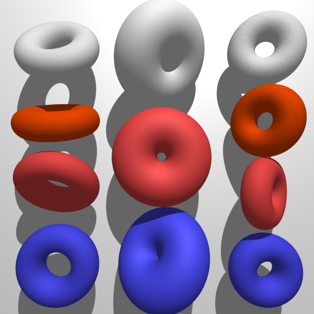

# Ray Tracing, A Waterfall

[back to home](/index.md)

This is my Ray Tracer that I created for the final project of CS 488: Computer Graphics at the University of Waterloo in the Spring 2019 term. I recieved the bronze medal. 

My goal was to create a scenic scene of a waterfall, attempting to model water and textures.

My final paper can be found [here](waterfall-images/finalpaper.pdf) with details on theory and implementation along with references.

### Objective 1: Extra Primitives - Cylinder and Torus

### Objective 2: Antialiasing (super sampling)

### Objective 3: Depth of Field

### Objective 4: Glossy Reflection

### Objective 5: Refraction

### Combining Reflection and Refraction

### Objective 6: Soft Shadows

### Objective 7: Texture Mapping

### Objective 8: Bump Mapping

### Texture Mapping vs Bump Mapping

### Objective 9: Perlin Noise

### Bonus: “Mist” (Volumetric Material)

The intersection point t was computed, and then a random distance was added according to a set density value. (from Ray Tracing: The Next Week, Peter Shirley)

### Final Scene

### Some Fun Bugs

