# Ray Tracing, A Waterfall

[back to home](/index.md)

This is my Ray Tracer that I created for the final project of CS 488: Computer Graphics at the University of Waterloo in the Spring 2019 term. I recieved the bronze medal. 

My goal was to create a scenic scene of a waterfall, attempting to model water and textures.

My final paper can be found [here](waterfall-images/finalpaper.pdf) with details on theory and implementation along with references.

### Objective 1: Extra Primitives - Cylinder and Torus

### Objective 2: Antialiasing (super sampling)
Original:
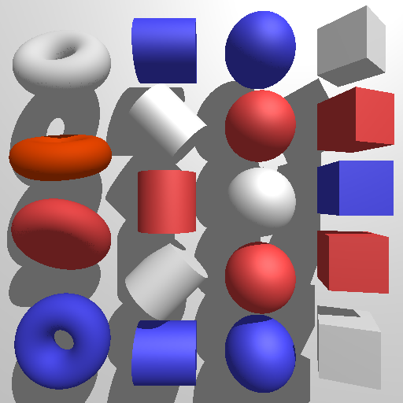

With anti-aliasing:

### Objective 3: Depth of Field
Original:
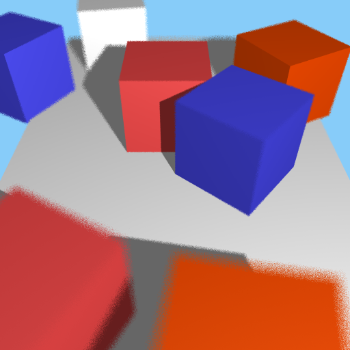

With depth of field:
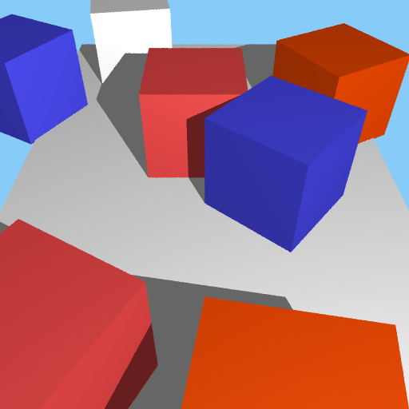

### Objective 4: Glossy Reflection
Mirror reflection: (previously completed)

Glossy reflection:
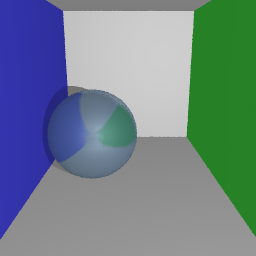

--

Mirror reflection:
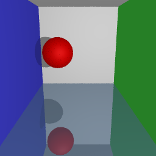

Glossy reflection:
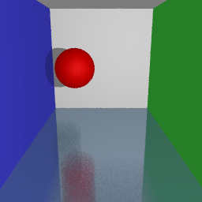

### Objective 5: Refraction
No refraction:
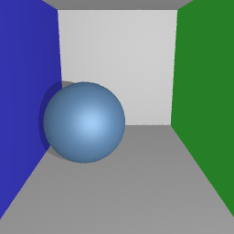

Refractive index = 1, fully transmissive:

Refractive index = 1.5:
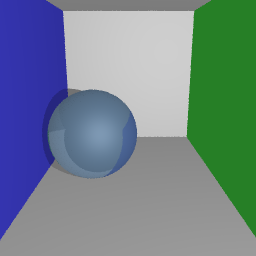

### Combining Reflection and Refraction
Only reflection:
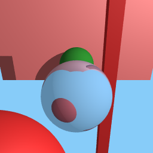

Only refraction:

Both reflection and refraction:
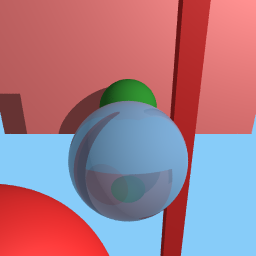

### Objective 6: Soft Shadows
Original:
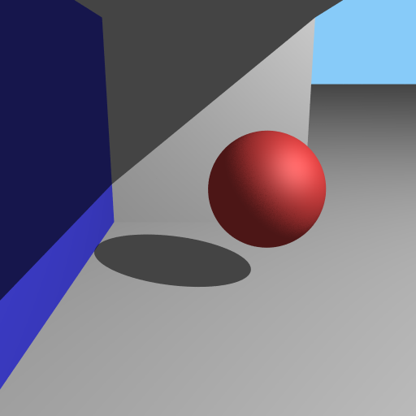

With soft shadows:
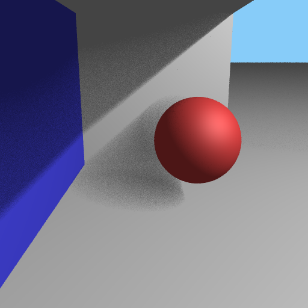

### Objective 7: Texture Mapping
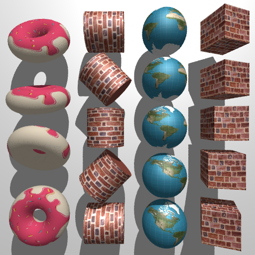

### Objective 8: Bump Mapping
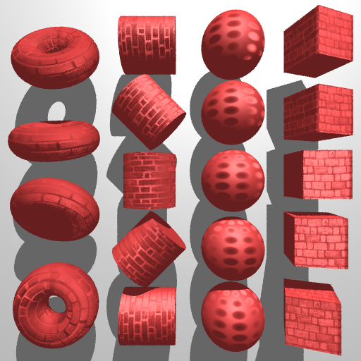

### Texture Mapping vs Bump Mapping
The differences between texture mapping and bump mapping are subtle, and one single image could be either. The difference is that when the light source moves, the texture mapped image remains the same as it is just an image applied. However, on the bump mapped image, the highlights and shadow shift as we are simulating bumps on the surface of the object.

This can be seen in the comparison of two gifs:

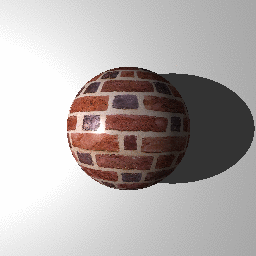
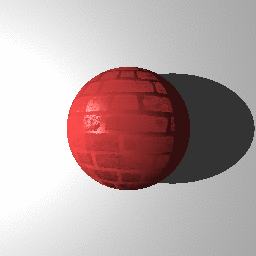

### Objective 9: Perlin Noise

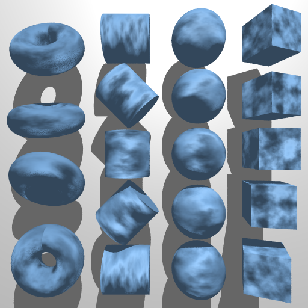

Perlin noise can also be difficult to differentiate from bump and texture mapping, as a texture or bump map could have a static perlin noise image. Therefore, I can show that with slight variations in provided coordinates, the perlin function can change slowly and show that it is being generated using Perlin noise:

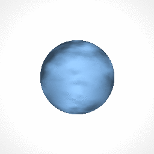

### Bonus: “Mist” (Volumetric Material)

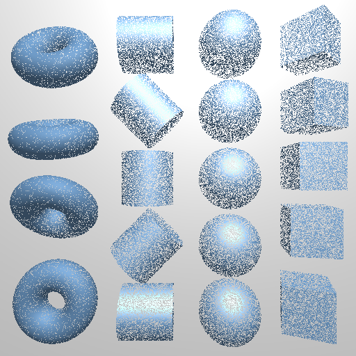

To achieve this, the intersection point t was computed, and then a random distance was added according to a set density value. (from Ray Tracing: The Next Week, Peter Shirley)

### Final Scene
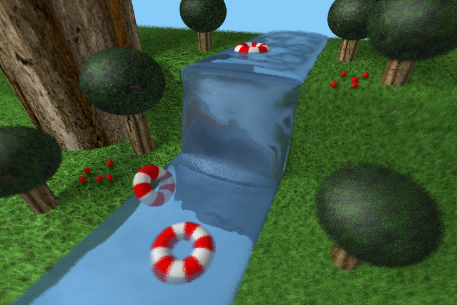

